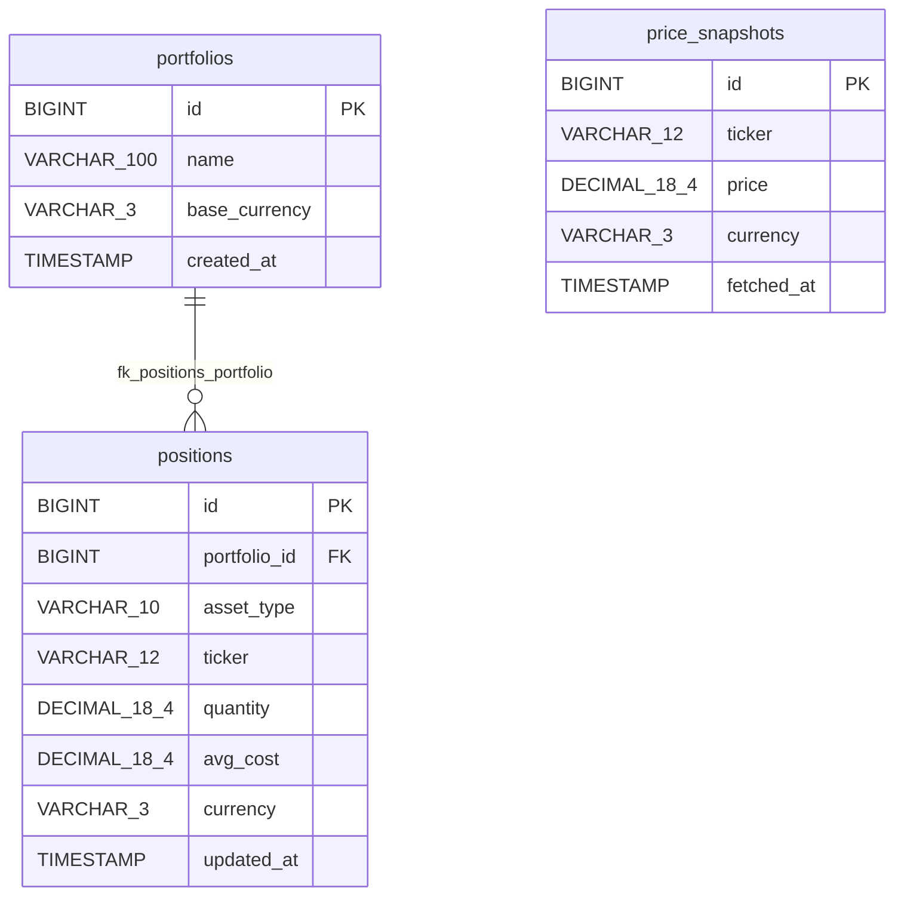

# Database ER Diagram

This ER diagram is generated from Flyway migrations in `src/main/resources/db/migration`.

## Notes

- Core relation: `portfolios (1) -> (N) positions`.
- `price_snapshots` is currently independent (no foreign key to other tables).
- `asset_type` enum values used by backend: `STOCK`, `BOND`, `CASH`, `ETF`, `FUND`, `CRYPTO`.

## Indexes (from Flyway)

- `positions`: `idx_positions_portfolio_id (portfolio_id)`, `idx_positions_ticker (ticker)`
- `price_snapshots`: `idx_price_snapshots_ticker (ticker)`, `idx_price_snapshots_fetched_at (fetched_at)`

## Flyway Source

- `V1__init_schema.sql`: create `portfolios`, `positions`, and FK.
- `V2__add_indexes.sql`: add indexes on `positions`.
- `V3__add_price_snapshots.sql`: create `price_snapshots` + indexes.
- `V4__extend_asset_type.sql`: keep `positions.asset_type` as `VARCHAR(10)`.

